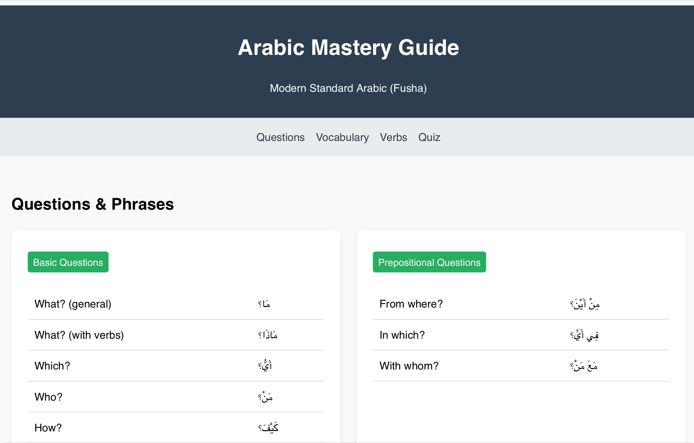

# Arabic Study Guide 🎓🌍

A minimalist, interactive web platform for learning Modern Standard Arabic (Fusha). Built with pure HTML/CSS/JS.

[](https://yourusername.github.io/arabic-study-guide) 


<div align="center">
  
</div>

## Features ✨
- **Essential Vocabulary**: 50+ words across 8 categories (Family, Work, Time, etc.)
- **Verb Mastery**: Present tense conjugations with vowel markings (ḥarakāt)
- **Smart Quiz System**: Instant feedback + score tracking
- **Mobile-Ready**: Responsive design for all devices
- **Zero Dependencies**: Vanilla JS, no frameworks

## Quick Start 🚀
```bash
git clone https://github.com/yourusername/arabic-study-guide.git
cd arabic-study-guide
open index.html


```

## How to Use 📖
1. **Study Mode**  
   Browse vocabulary cards and verb tables
2. **Practice Mode**  
   Test knowledge with auto-generated quizzes
3. **Track Progress**  
   Scores persist through session (localStorage)

## Roadmap 🗺️
- [ ] Add audio pronunciations
- [ ] Flashcards with spaced repetition
- [ ] User accounts
- [ ] Progress analytics

## Contribute 🤝
Found a typo? Have feature ideas?
1. Fork repo
2. Create branch (`git checkout -b improve/feature`)
3. Commit changes
4. Push & open PR

## License 📜
MIT © Asia Grady - Free for educational use
